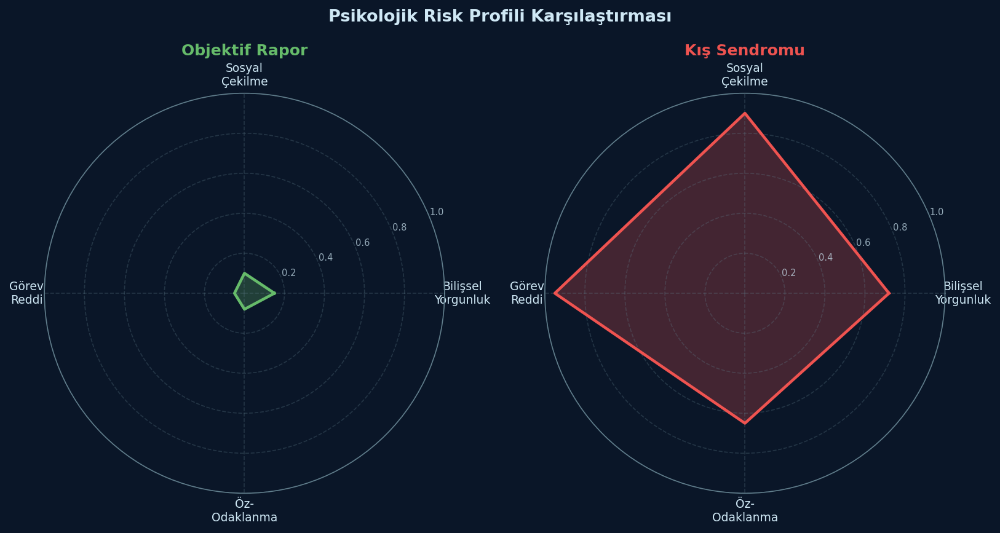
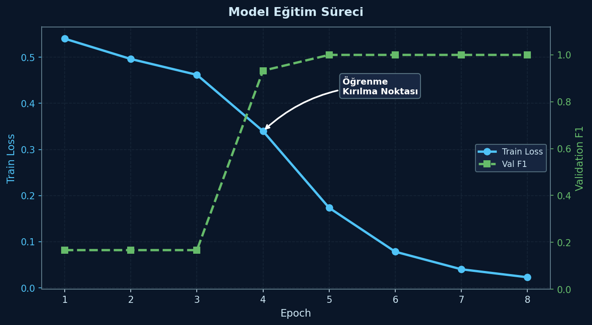
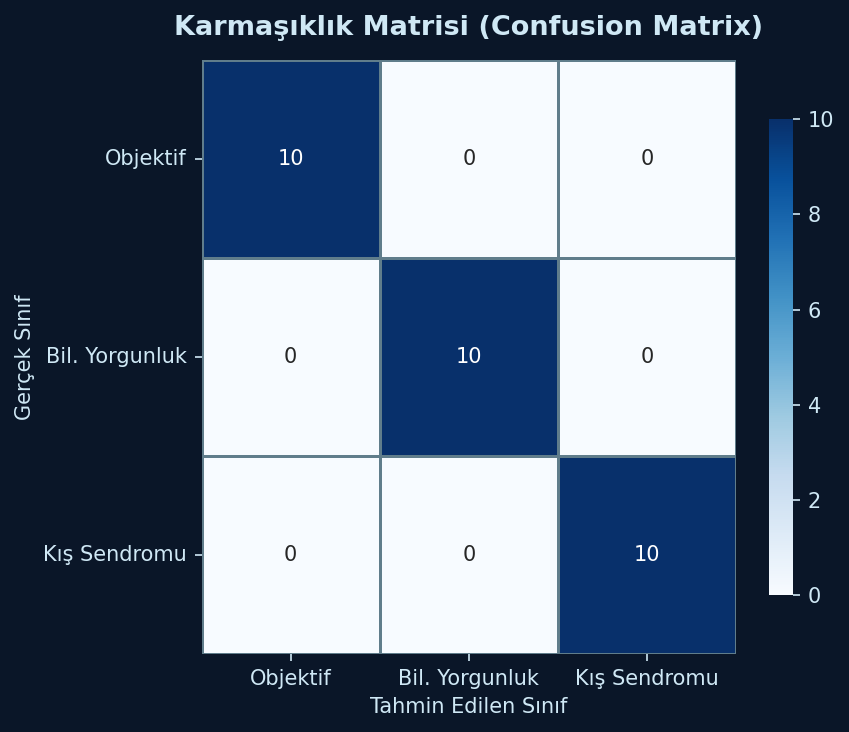
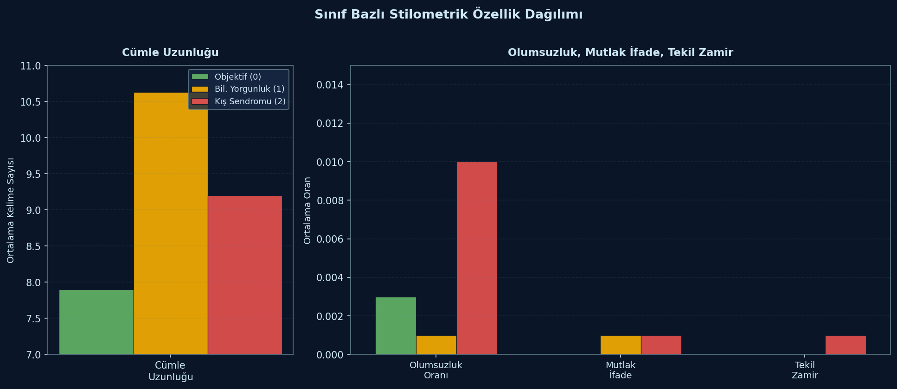
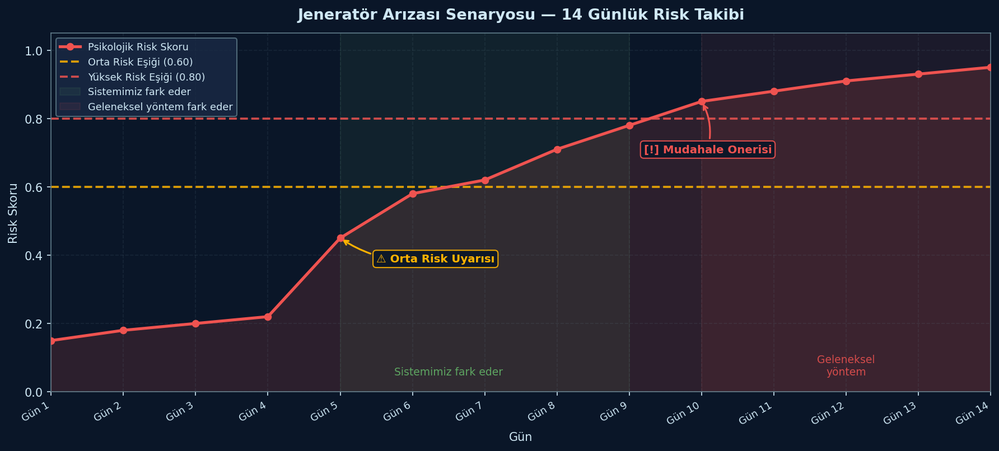

# 🧊 Polar NLP

<p align="center">
  <strong>TR-KABÜ · Prototip v0.2</strong><br>
  <em>Türkçe Doğal Dil İşleme ile Psikososyal Risk Taraması</em>
</p>

<p align="center">
  
</p>

---

## 📋 Proje Hakkında

**Polar NLP**, Türkiye'nin **Kalıcı Türk Bilim Üssü (TR-KABÜ)** konsepti için geliştirilmiş, Antarktika'daki personelin seyir defteri kayıtlarını analiz ederek psikososyal risk taraması yapan bir **Türkçe Doğal Dil İşleme (NLP)** prototipidir.

Personelin yazdığı günlük operasyon raporlarından 3 psikolojik durumu sınıflandırır ve 4 eksenli bir risk profili çıkarır.

### 🎯 Sınıflandırma Hedefleri

| ID | Sınıf | Açıklama | Örnek İfade |
|---|---|---|---|
| 0 | **Objektif Rapor** | Nötr, teknik gözlem | *"Jeneratör manifold bakımı standart prosedüre göre tamamlanmıştır."* |
| 1 | **Bilişsel Yorgunluk** | Mental yorgunluk, dikkat dağınıklığı | *"Kış başından beri talep ettiğim izolatör revizyonu göz ardı ediliyor."* |
| 2 | **Kış Sendromu** | Polar T3 sendromu, görev reddi | *"İlkel fırça yöntemleriyle yüzey temizliği sağlamak verimsiz bulunduğundan işlem iptal edilmiştir."* |

---

## 🧠 Hibrit Mimari

Bu projenin temel yeniliği, **BERTurk dil modeli** ile **stilometrik analizi** birleştiren hibrit yaklaşımdır:

```
                              ┌─────────────────────┐
                              │   BERTurk [CLS]      │
                              │   (768-dim)          │
                              └──────────┬──────────┘
                                         │
                              ┌──────────▼──────────┐
    ┌─────────────────┐       │                     │
    │ Stilometri (5)  ├──────►│   Füzyon Katmanı    │
    │ - 1. tekil zamir│       │   Linear(773→256)   │
    │ - TTR           │       │   ReLU + Dropout    │
    │ - Mutlak ifade  │       │   Linear(256→3)     │
    │ - Cümle uzunluğu│       │   Softmax           │
    │ - Olumsuzluk    │       └──────────┬──────────┘
    └─────────────────┘                  │
                              ┌──────────▼──────────┐
                              │   Sınıf + Risk      │
                              │   Profili Çıktısı   │
                              └─────────────────────┘
```

### 🤖 Bileşen 1: BERTurk Gömmeleri (768-boyutlu)

`dbmdz/bert-base-turkish-cased` modelinin `[CLS]` token çıktısı, metnin bağlamsal anlamını temsil eder. 128 token uzunluğunda, Türkçe morpholojisine duyarlı alt kelime tokenizasyonu kullanır.

### 📊 Bileşen 2: Stilometrik Özellikler (5-boyutlu)

LIWC/Pennebaker yaklaşımından esinlenen, saf regex tabanlı 5 özellik:

| Özellik | Formül | Psikolojik Gösterge |
|---|---|---|
| **1. Tekil Zamir Oranı** | `ben/bana/benim/bende/benden` sıklığı | Stres altında artan içe odaklanma |
| **TTR (Tip-Token Oranı)** | Benzersiz kelime / Toplam kelime | Bilişsel yorgunlukla daralan kelime dağarcığı |
| **Mutlak İfade Oranı** | `asla/hiçbir/kesinlikle/daima/tamamen` sıklığı | Katı düşünce yapısı, görev reddi |
| **Ortalama Cümle Uzunluğu** | Kelime sayısı / Cümle sayısı | Düşen bilişsel yük göstergesi |
| **Olumsuzluk Oranı** | `değil/yok/hayır/red*` sıklığı | Sosyal çekilme, pasif direnç |

### 🔗 Füzyon ve Sınıflandırma

BERTurk çıktısı (768) ile stilometri vektörü (5) birleştirilerek 773-boyutlu bir temsil oluşturulur. Bu temsil, 256 nöronlu gizli katmandan geçirilir ve 3 sınıflı softmax çıktısına bağlanır.

### ⚠️ Çelişki Çözümü

Düşük güven skoru (< 0.50) durumlarında, stilometrik risk profili devreye girer ve sinyalin daha güçlü olduğu yönde karar verilir. Bu mekanizma, sınırlı veri (300 örnek) ile eğitilen modelin BERT bileşenindeki zayıflıkları telafi etmek için tasarlanmıştır.

---

## 🚀 Kurulum

### Gereksinimler

- Python 3.10+
- NVIDIA RTX 3060 12GB VRAM (önerilen, CUDA ile ~5dk eğitim)
- CPU ile de çalışır (~30dk eğitim)

### Adımlar

```bash
# 1. Depoyu klonla
git clone https://github.com/aglamazlarefe/Polar_NLP.git
cd Polar_NLP

# 2. Sanal ortam oluştur (önerilen)
python -m venv venv
source venv/bin/activate   # Linux/Mac
# venv\Scripts\activate    # Windows

# 3. Bağımlılıkları yükle
pip install -r requirements.txt
```

---

## 💻 Kullanım

### Veri Dönüşümü

DOCX formatındaki ham seyir defteri kayıtlarını CSV'ye dönüştürün:

```bash
python temp_convert3.py
```

### Model Eğitimi

**Seçenek A — Baseline: BERTurk Fine-Tuning**

```bash
python train_berturk.py
```

- Vanilla HuggingFace Trainer
- 4 epoch, lr 2e-5, fp16
- Macro F1 odaklı en iyi checkpoint seçimi
- Çıktı: `./egitilmis_berturk_modeli/`

**Seçenek B — Hibrit Model (Önerilen)**

```bash
python train_hybrid.py
```

- BERTurk + Stilometri füzyonu
- 8 epoch, lr 3e-5, class-weight (Kış Sendromu: 2.5×)
- Custom training loop + GradScaler AMP
- Çıktı: `./egitilmis_hybrid_model/`

### Inference Testi

```bash
python test.py
```

### Dashboard'u Başlatma

```bash
streamlit run dashboard.py
```

Dashboard 4 sayfa içerir:
| Sayfa | Açıklama |
|---|---|
| **🔍 Tekil Analiz** | Tek bir metnin anlık analizi + 3 hazır senaryo |
| **📁 Toplu Analiz** | CSV yükleme, toplu risk taraması, rapor indirme |
| **📊 Model Sonuçları** | Eğitim grafikleri, confusion matrix, karşılaştırmalar |
| **ℹ️ Sistem Hakkında** | Mimari dokümantasyon, teknik özellikler, etik notlar |

---

## 📁 Proje Yapısı

```
Polar_NLP/
├── train_hybrid.py          # ★ Hibrit mimari: BERTurk + Stilometri eğitimi
├── train_berturk.py         # Baseline BERTurk fine-tuning
├── dashboard.py             # Streamlit web arayüzü (4 sayfa)
├── gorseller.py             # Rapor görselleştirme aracı
├── test.py                  # Hızlı inference testi
├── temp_convert3.py         # DOCX → CSV dönüştürücü
├── output_utf8.csv          # 300 satırlık eğitim veri seti
├── requirements.txt         # Bağımlılıklar
├── results/                 # Rapor görselleri
│   ├── confusion_matrix.png
│   ├── egitim_egrisi.png
│   ├── radar_profil.png
│   ├── senaryo_simulasyon.png
│   └── stilometri_karsilastirma.png
└── seyir defteri veri seti.docx  # Ham veri kaynağı (DOCX)
```

---

## 📊 Veri Seti

- **300** sentetik Türkçe metin (102 Objektif, 99 Bilişsel Yorgunluk, 99 Kış Sendromu)
- Antarktika bilim üssü temalı: jeneratör, VHF telsiz, anten, buz karotu, radyosonda, katabatik fırtına
- **80/10/10** stratified train/val/test ayrıştırması
- Ortalama metin uzunluğu: ~250-350 karakter

### Örnek Metinler

> **Objektif Rapor (0):**
> *"Jeneratör manifold bakımı standart prosedüre göre tamamlanmıştır. Voltaj dalgalanması gözlenmedi. Yakıt pompası basıncı nominal değerlerde seyrediyor."*

> **Bilişsel Yorgunluk (1):**
> *"Ana anten kulesindeki parazitlenme seviyesi kritik sınıra ulaştı. Kış başından beri talep ettiğim izolatör revizyonunun göz ardı edilmesi sebebiyle frekans kayıpları yaşanıyor."*

> **Kış Sendromu (2):**
> *"Albedo optik sensörlerindeki karları manuel fırçalamak iş tanımımdaki teknolojik sürece aykırıdır. İlkel fırça yöntemleriyle yüzey temizliği sağlamak verimsiz bulunduğundan işlem iptal edilmiştir."*

---

## 🖼️ Rapor Görselleri

<p align="center">
  
  
</p>

<p align="center">
  
  
</p>

---

## 🛠️ Teknik Özellikler

| Özellik | Değer |
|---|---|
| **Dil Modeli** | `dbmdz/bert-base-turkish-cased` (110M parametre) |
| **Mimari** | BERTurk [CLS] (768) ⊕ Stilometri (5) → Linear(256) → Linear(3) |
| **Maksimum Uzunluk** | 128 token |
| **Optimizasyon** | AdamW, linear schedule, %10 warmup |
| **Mixed Precision** | torch.amp.GradScaler (fp16) |
| **Batch Size** | 16 (gradient accumulation ×2 → efektif 32) |
| **GPU** | NVIDIA RTX 3060 12GB (önerilen) |
| **Eğitim Süresi** | ~5 dk (CUDA) / ~30 dk (CPU) |
| **Loss** | CrossEntropyLoss (weighted: Kış Sendromu 2.5×) |

---

## ⚠️ Etik ve Yasal Uyarılar

> Bu proje **tıbbi bir tanı aracı değildir**. Psikolojik değerlendirme yalnızca uzman sağlık profesyonelleri tarafından yapılmalıdır.
>
> Sistem, insan yargısının yerini almak için değil, **desteklemek** için tasarlanmıştır. Çıktılar karar vericiye yardımcı sinyaller olarak değerlendirilmelidir.
>
> **KVKK/GDPR uyumluluğu esastır**: Ham metin verileri kalıcı olarak saklanmaz, analiz sonuçları anonimleştirilir.

---

## 📈 Proje Yol Haritası

- [x] DOCX → CSV veri dönüştürme pipeline'ı
- [x] BERTurk fine-tuning baseline
- [x] Hibrit (BERTurk + Stilometri) mimari
- [x] Streamlit dashboard (4 sayfa)
- [x] Rapor görselleştirmeleri
- [ ] Model ağırlıklarının HuggingFace Hub'a yüklenmesi
- [ ] Çok dilli desteğin eklenmesi (İngilizce, Rusça)
- [ ] Gerçek dünya verisi ile validasyon
- [ ] Zaman serisi analizi (bireysel trend takibi)
- [ ] CI/CD pipeline'ı

---

## 🤝 Katkıda Bulunma

Proje açık kaynak olup, katkılara açıktır. Lütfen:

1. Fork edin
2. Feature branch oluşturun (`git checkout -b feature/yeni-ozellik`)
3. Değişikliklerinizi commit edin
4. Branch'inizi push edin
5. Pull Request açın

---

## 📄 Lisans

Bu proje **MIT lisansı** ile lisanslanmıştır. Detaylar için `LICENSE` dosyasına bakınız.

---

## 👨‍💻 Geliştirici

**Efe Ağlamazlar** — NLP Geliştiricisi & Araştırmacı

<p align="center">
  <sub>
    🧊 Polar NLP · Türkçe Doğal Dil İşleme · Psikososyal Risk Analizi<br>
    <em>Kalıcı Türk Bilim Üssü (TR-KABÜ) için prototip çalışması</em>
  </sub>
</p>
